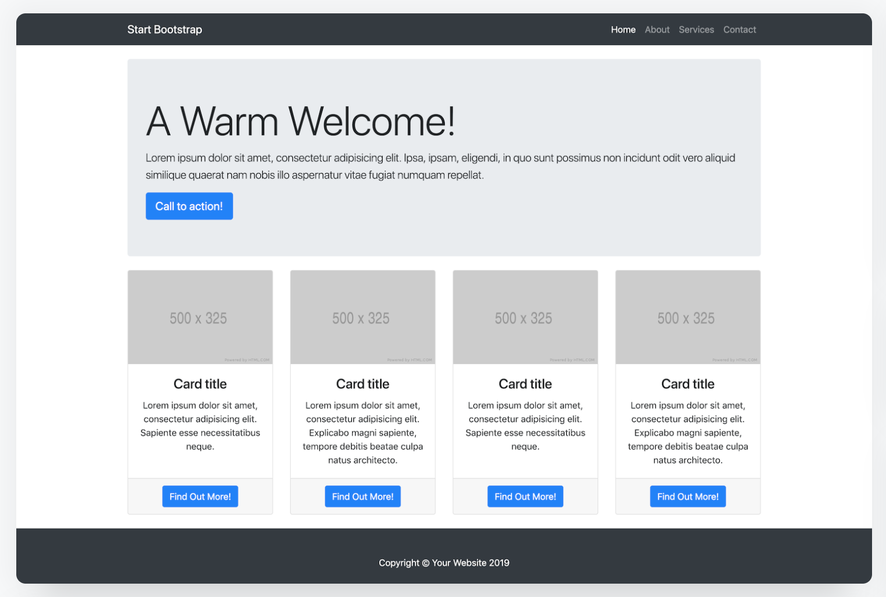

# first-bootstrap-project
## Creating a basic page layout with Bootstrap.
### Description
This is a learning project where I apply what I learned about Bootstrap framework to create a simple page based on a template:



<br>I explored using Bootstrap basic features like Bootstrap grid, breakpoints, utilities, and components (buttons, cards, navigation menu).
### Installation
To run and edit this code on your local computer you can take the following steps:
1. Fork this repository by clicking the "Fork" button (it should be located in the top-right corner of the page)
2. Open the forked repository in your GitHub account
3. Click on the "Code" button (it should be green and located towards the top-right of the page) and copy the URL of the repository.
4. Open up your terminal or command prompt and navigate to the directory where you want to clone the repository.
5. Clone the repository to your local computer by running the `git clone` command:
```
git clone https://github.com/username/repository.git
```
6. Once the repository is cloned, navigate into the repository directory (the target folder should take the name of the cloned repository)
### Usage
To use and navigate the page created in this project follow [this link](https://woachkatzl.github.io/first-bootstrap-project/)
- Changing the size of your browser window will change the section size to maintain the centered look.
- Changing the size of your browser window will also change the placement of the header elements and positioning of the cards. They will always be positioned with even spaces between them taking the entire width of the section. As the window width gets narrower the cards will be pushed down to form another row until they are all placed one ander another on a mobile screen.
### Credits
I have used [Bootstrap documentation](https://getbootstrap.com/docs/5.3/getting-started/introduction/) to complete this project.